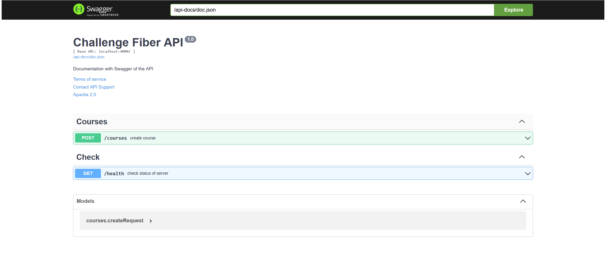

<p align="center">
  <a href="" rel="noopener">
 </a>
</p>

<h3 align="center">[Architecture Hexagonal, Dependency Injection, Swagger, Unit-Test]</h3>

<div align="center">

[]()
[](https://github.com/kylelobo/The-Documentation-Compendium/pulls)
[](/LICENSE)

</div>

---

<p align="center">
  Use of Fiber Web Framework, hexagonal architecture, dependency injection, unit test and very good practices.
    <br>
</p>

## 📝 Table of Contents

- [About](#about)
- [Documentation](#docs)
- [Getting Started](#getting_started)
- [Deployment with Docker](#deployment)
- [Usage](#usage)
- [Built Using](#built_using)
- [Authors](#authors)

## 🧐 About <a name = "about"></a>

This project has enough foundation to understand Fiber, it should be noted that this project is written in golang and effectively uses clean architecture like hexagonal.

## 💾 Documentation <a name = "docs"></a>



## 🏁 Getting Started <a name = "getting_started"></a>

These instructions will get you a copy of the project up and running on your local machine for development and testing purposes. See [deployment](#deployment) for notes on how to deploy the project on a live system.

### Prerequisites

Go v1.16 or higher

```
go version
```

### Installing

Configure the variables environment in docker-compose, reference the config structure inside the ```cmd/api/boostrap.go``` file.

```
type config struct {
	// Server configuration
	Host            string        `default:"localhost"`
	Port            uint          `default:"4000"`
	ShutdownTimeout time.Duration `default:"10s"`
	// Database configuration
	DbUser    string        `default:"test"`
	DbPass    string        `default:"test"`
	DbHost    string        `default:"localhost"`
	DbPort    uint          `default:"3306"`
	DbName    string        `default:"test"`
	DbTimeout time.Duration `default:"5s"`
}
```

```
api:
    build: .
    environment:
      FIBER_HOST: 0.0.0.0
      FIBER_DBHOST: mysql
    ports:
      - 8080:4000
```

Add project dependencies

```
go get
```

Run the application in development

```
go run ./cmd/api/main.go
```

If all went well visit the next page

```
localhost:{your_port}
```

## 🔧 Running the tests <a name = "tests"></a>

run the tests

```
go test
```

## 🎈 Usage <a name="usage"></a>

To view and interact with API REST visit the documentation.

```
localhost:{your_port}/api-docs
```

## 🚀 Deployment with Docker <a name = "deployment"></a>

```
docker-compose up -d
```

## ⛏️ Built Using <a name = "built_using"></a>

- [MySQL](https://www.mysql.com/) - Database
- [Fiber](https://gofiber.io/) - Server Framework
- [Golang](https://go.dev/) - Programing Language
- [Docker](https://www.docker.com/) - Docker

## ✍️ Authors <a name = "authors"></a>

- [@ArthurDev](https://github.com/ArthurQR98) - Idea & Initial work